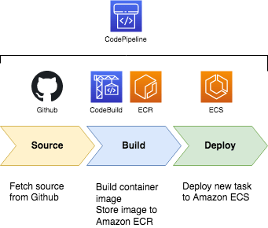

# Implementation of CI/CD for containers on AWS using ECS and CodePipeline
***

***
We are going to use **AWS CodePipeline** to model our pipeline. The pipeline itself will have 3 stages: Source, Build, and Deploy. 
1. The first stage **Source** will fetch the source code from **bitbucket** and send the artifact to the next stage. 
2. Second stage **Build** will use AWS CodeBuild to run the docker image building from the code artifact and then store the image to **Amazon ECR**. This stage will output the container name and the image URL as artifact to next stage. 
3. The last stage **Deploy** will use update **Amazon ECS** to use the new image URL for its container. 
***
## Pre-requisites:
1. Your source code including buildspec.yml in the root folder. \
buildspec.yaml file \
***Create AWS ECR***
Make sure you replace the REPOSITORY_URI with your AWS ECR Repository URL and Container name value (AWS Task Definition Container Name).
```
version: 0.2
phases:
  pre_build:
    commands:
      - echo Logging in to Amazon ECR...
      - aws --version
      - aws ecr get-login-password \
        --region <region> \
        docker login \
        --username AWS \
        --password-stdin <aws_account_id>.dkr.ecr.<region>.amazonaws.com
      - REPOSITORY_URI=<your_ecr_repo_url>
      - COMMIT_HASH=$(echo $CODEBUILD_RESOLVED_SOURCE_VERSION | cut -c 1-7)
      - IMAGE_TAG=build-$(echo $CODEBUILD_BUILD_ID | awk -F":" '{print $2}')
build:
    commands:
      - echo Build started on `date`
      - echo Building the Docker image...
      - docker build -t $REPOSITORY_URI:latest .
      - docker tag $REPOSITORY_URI:latest $REPOSITORY_URI:$IMAGE_TAG
post_build:
    commands:
      - echo Build completed on `date`
      - echo Pushing the Docker images...
      - docker push $REPOSITORY_URI:latest
      - docker push $REPOSITORY_URI:$IMAGE_TAG
      - echo Writing image definitions file...
      - printf '[{"name":"<Your Container Name>","imageUri":"%s"}]'    $REPOSITORY_URI:$IMAGE_TAG > imagedefinitions.json
      - cat imagedefinitions.json
artifacts:
  files: imagedefinitions.json
```
Commit all changes \
**Note:** \
buildspec.yaml required for AWS codebuild

## Initial Step
Go to https://eu-west-1.console.aws.amazon.com/codesuite/home?region=eu-west-1 \
Click Pipeline \
Create a new project with CodePipeline \
Give the project a name \
Choose New Service Role \
click Next 


## Step 1 - Source stage
choose the source location where the code is stored. This could be AWS CodeCommit, GitHub, BitBucket or Amazon S3. \
Source Provider select BitBucket \
select Repository name \
select branch - master \
Click Next \


## Step 2 -  Build Stage 
Build provider: AWS CodeBuild \
default region \
Project : 
* For Create a new build project 
* Environment image: Use an image managed by AWS CodeBuild 
* Operating system: Ubuntu 
* Runtime: Docker 
* Version: aws/codebuild/docker:1.12.1 
* Build specification: Use the buildspec.yml in the source code root directory \

### Update CodeBuild Project IAM Role:
Go to IAM Console and find IAM role created by your codebuild project \
***Add permissions to ECR full access (AmazonEC2ContainerRegistryFullAccess policy)***


***
## Before deployment stage create running ECS Cluster, service and task definition.
### AWS ECS (Elastic Container Service)
It is a service that manages the containers. \
Amazone ECS maintains the availability of the application and allows every user to scale containers when necessary. \
ECS is container management service which can quickly launch,exit abd manage docker containers on a cluster. \
**ECS Terminology**
* **Task Definition** — This a blueprint that describes how a docker container should launch. It contains settings like exposed port, docker image, cpu shares, memory requirement, command to run and environmental variables.
* **Task** — This is a running container with the settings defined in the Task Definition. It can be thought of as an “instance” of a Task Definition.
* **Service** — Defines long running tasks of the same Task Definition. This can be 1 running container or multiple running containers all using the same Task Definition.
* **Cluster** — A logic group of EC2 instances.


### Run ECS Clusters on EC2 Spot Instances
* Step 1: Select a Cluster Template

* Step 2: Configure your Cluster

* Step 3: Create a New Task Definition
click on “Add Container”. \
container name and image values from buildspec.yml file.\
All configuration related to container image.


* Step 4: Configure your ECS service

click next step


***
## Step 3 - Deploy stage
Add a deployment \
Deploy provider : Choose AWS ECS. (This is the infrastructure where your code will be deployed.) \
cluster name : choose already created cluster \
service name : choose already created cluster \
imagedefinitions.json artifacts files 


### Lastly, review all of your config, and click Create pipeline.
### Now when we commit to master branch, pipeline automatically triggers.